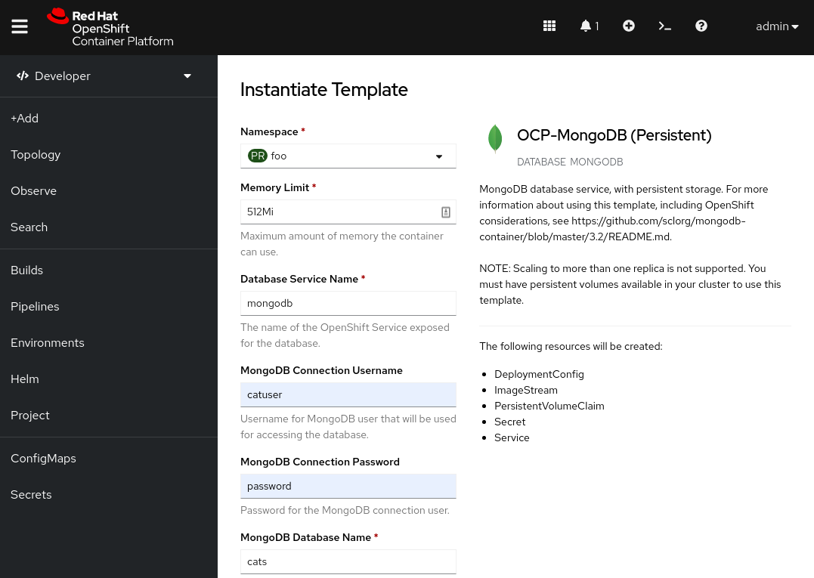
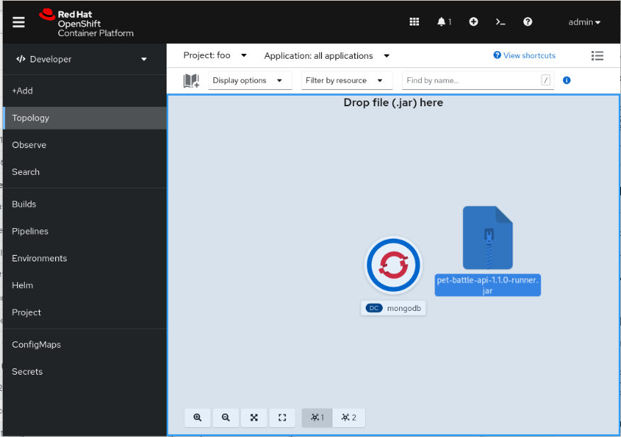

[](https://github.com/petbattle/pet-battle-api/actions/workflows/build_container.yaml)
[](https://github.com/petbattle/pet-battle-api/actions/workflows/codeql.yml)

# pet-battle-api

A reactive back end for [pet battle](https://github.com/petbattle/pet-battle) based on the quarkus reactive mutiny framework with mongodb and panache. 

### Develop

#### for the impatient

```
make podman-run
```
 
#### local commands

Database:
```
podman run --name mongo -p 27017:27017 mongo:latest
```

Application:
```bash
mvn -s settings.xml compile quarkus:dev
```
OR
```
java -Dquarkus-profile=dev -jar ./target/pet-battle-api-1.0-SNAPSHOT-runner
```
OR
```
podman run -e QUARKUS_PROFILE=dev -e quarkus.mongodb.connection-string=mongodb://localhost:27017 quay.io/petbattle/pet-battle-api:latest
```

OR we can also run a podman `pod` as opposed to single containers:
```
podman run -d --pod new:pb -p 27017:27017 -p8080:8080 -p8443:8443 mongo:latest
podman run -d --pod pb -e quarkus.mongodb.connection-string=mongodb://localhost:27017 quay.io/eformat/pet-battle-api:latest
```

See Makefile for container targets:
```
make podman-build
make podman-run
make podman-stop
make podman-push
```

### Helm3

New project
```
oc new-project cats
```

`Using the mongo-persistent template` on OpenShift
```
helm template --dependency-update cats -f chart/values.yaml chart | oc apply -f-
```

OR from deployed chart
```
helm repo add https://petbattle.github.io/helm-charts
helm install pet-battle-api https://petbattle.github.io/helm-charts/pet-battle-api-1.1.0.tgz 
```

`With mongodb replicaset` (TODO: replicaset commented out for now but works ok)

Get SCC UID for project
```bash
oc new-project cats
SCC=$(oc get project cats -o jsonpath='{.metadata.annotations.openshift\.io/sa\.scc\.uid-range}')
SCCUID=${SCC%%/*}

helm template foobar -f chart/values.yaml --set mongodb-replicaset.securityContext.fsGroup=$SCCUID --set mongodb-replicaset.securityContext.runAsUser=$SCCUID --set mongodb-replicaset.persistentVolume.storageClass=gp2 --set mongodb-replicaset.persistentVolume.size=1Gi chart | oc apply -f-
```

### Deploy to OpenShift using a JAR

OpenShift has a cool feature where you can easily deploy an appl in development using [a JAR file](http://openshift.github.io/openshift-origin-design/designs/developer/4.8/upload-jar-file/)

There are two artifacts you will need in the [Release](https://github.com/petbattle/pet-battle-api/releases) folder

1. From `Developer` perspective `Add` YAML file - `mongodb-persistent.yml` - drag-n-drop this to create the MongoDB template.
2. Instantiate the mongo database instance, use `catuser`, `password` and `cats` as the database parameters:

3. Import JDK 17 image builder if it does not exist:
```bash
oc -n openshift import-image java:openjdk-17 --from=registry.access.redhat.com/ubi8/openjdk-17:latest --confirm
oc -n openshift annotate istag java:openjdk-17 supports='java:17,java' tags='builder,java,openjdk'
```
4. From `Topology` view drag-n-drop the `pet-battle-api-<version>-runner.jar` to build and create the app deployment. Use the `openjdk-17` Builder image version drop down imported in (3)

5. Wait for application to deploy and try it out.

### Build and Deploy on OpenShift using s2i.

Deploy Mongo
```bash
oc new-project cats
oc apply -n openshift -f mongodb-persistent.yml
oc new-app mongodb-persistent -p MONGODB_DATABASE=cats
```

We are going to use a 2-step build process - see [here](https://eformat.github.io/ubi-mvn-builder) for more details.

Create the builder image to build our code.
```bash
oc new-build --name=cats-build \
  quay.io/eformat/ubi-mvn-builder:latest~https://github.com/petbattle/pet-battle-api \
  -e MAVEN_BUILD_OPTS="-Dquarkus.package.type=fast-jar -DskipTests" \
  -e MAVEN_CLEAR_REPO="true"
```

(optional) If local nexus deployed to OpenShift, use this env.var
```bash
oc set env bc/cats-build MAVEN_MIRROR_URL=http://nexus.nexus.svc.cluster.local:8081/repository/maven-public/
```

Once complete, create the runtime image.
```bash
oc new-build --name=cats \
  --build-arg BUILD_IMAGE=image-registry.openshift-image-registry.svc:5000/$(oc project -q)/cats-build:latest \
  --strategy docker --dockerfile - < Dockerfile.s2i
```

Set triggers in case we change the build image:
```bash
oc set triggers bc/cats --from-image=$(oc project -q)/cats-build:latest
```

Deploy the app:
```bash
oc new-app cats \
  -e DATABASE_SERVICE_HOST=mongodb \
  -e DATABASE_SERVICE_PORT=27017 \
  -e DATABASE_NAME=cats
oc set env --from=secret/mongodb deployments/cats
oc expose svc/cats
oc patch route/cats \
      --type=json -p '[{"op":"add", "path":"/spec/tls", "value":{"termination":"edge","insecureEdgeTerminationPolicy":"Redirect"}}]'
```

### Swagger available at
```bash
http://cats-cats.apps.<cluster-domain>/swagger-ui
```

Test
```bash
mvn test
```

View test coverage report
```bash
xdg-open target/jacoco-report/index.html
```

Test manually
```bash
export CATID=5e69e003a765314bf6d04281
export HOST=0.0.0.0:8080

curl -s -H "Content-Type: application/json" -X GET http://${HOST}/cats | jq .
curl -s -H "Content-Type: application/json" -X GET http://${HOST}/cats/ids | jq .
curl -s -H "Content-Type: application/json" -X GET http://${HOST}/cats/count | jq .
curl -s -H "Content-Type: application/json" -X GET http://${HOST}/cats/${CATID} | jq .
curl -s -H "Content-Type: application/json" -X GET http://${HOST}/cats/${CATID} | jq ".id"
curl -s -H "Content-Type: application/json" -X GET http://${HOST}/cats/${CATID} | jq ".count"
curl -s -H "Content-Type: application/json" -X DELETE http://${HOST}/cats/${CATID}
curl -s -H "Content-Type: application/json" -X PUT http://${HOST}/cats/${CATID}
curl -s -H "Content-Type: application/json" -X GET http://${HOST}/cats/${CATID} | jq ".image" | sed -e 's|"||g' | base64 -d > ~/Pictures/foo.png
curl -s -H "Content-Type: application/json" -X GET http://${HOST}/cats/topcats | jq ".[].count"
curl -s -H "Content-Type: application/json" -X DELETE http://${HOST}/cats/kittykiller
curl -s -H "Content-Type: application/json" -X GET "http://${HOST}/cats/datatable?draw=1&start=0&length=10&search\[value\]=" | jq
curl -s -H "Content-Type: application/json" -X GET http://${HOST}/cats/loadlitter
```

### Prometheus & Grafana metrics endpoint
```bash
curl http://${HOST}/metrics/application
```

```bash
oc create configmap prom --from-file=prometheus.yml=src/main/kubernetes/prometheus.yml
oc apply -f src/main/kubernetes/prom-rbac.yaml
oc new-app prom/prometheus && oc expose svc/prometheus
oc set volume dc/prometheus --add -t configmap --configmap-name=prom -m /etc/prometheus/prometheus.yml --sub-path=prometheus.yml
oc rollout status -w dc/prometheus
oc new-app grafana/grafana && oc expose svc/grafana
oc rollout status -w dc/grafana
```

### Delete application (not mongodb)
```bash
oc delete dc,svc,route,is -lapp=cats
```
OR
```git exclude
helm delete pet-battle-api
```

